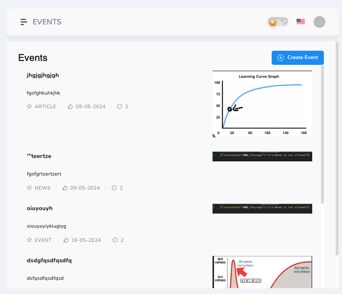
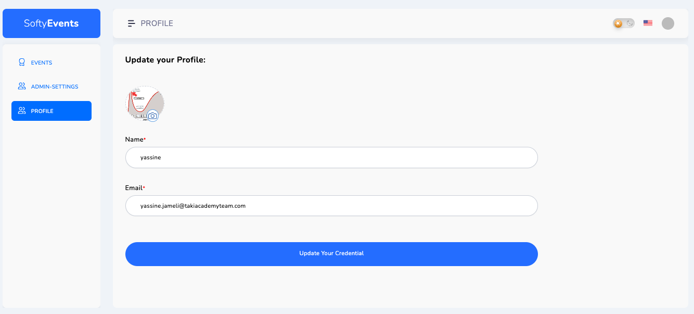
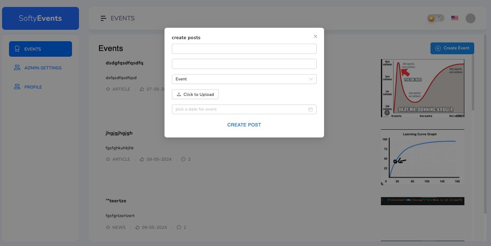
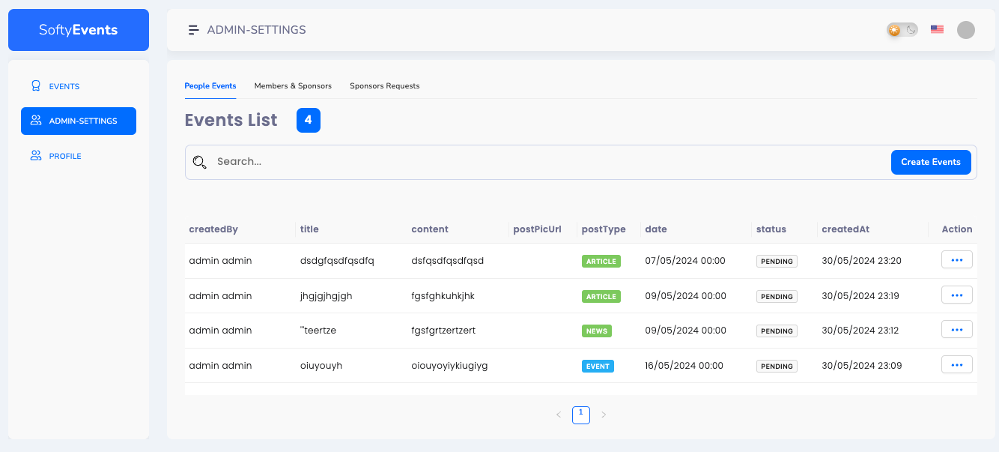
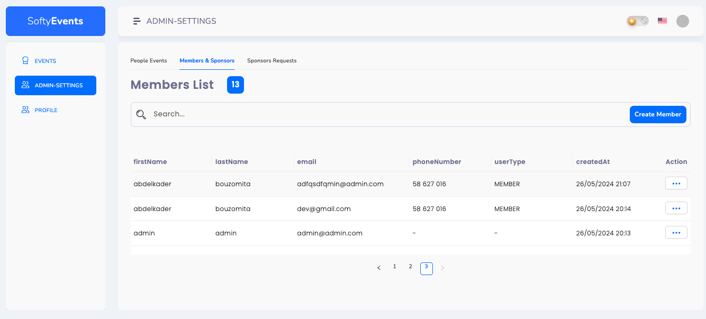
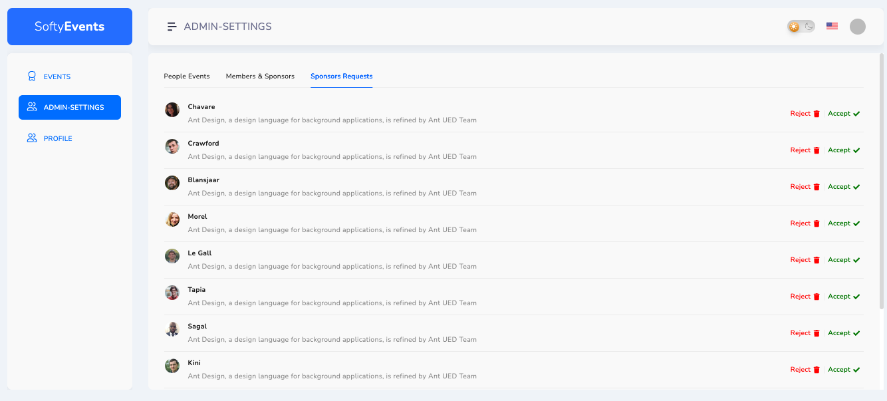

# SoftyEvents

SoftyEvents is an association management application designed to streamline the operations of associations by providing a comprehensive platform for managing members, roles, events, and news sharing. It aims to enhance communication, collaboration, and efficiency within associations in the digital age.

## Overview

In the digital age, the importance of efficient management tools cannot be overstated. SoftyEvents is built to adapt to these changes and provide associations with a user-friendly and efficient tool for managing their operations. From membership management to event planning, SoftyEvents offers a comprehensive solution for associations of all sizes.

## Functionalities

### Actors

- **Visitor**: An Internet user who is not registered in the system.
- **Office Member**: Responsible for managing the association's operations, including event management, member management, etc.
- **Member**: Participates in associative life, reviews notifications, and engages in activities.
- **Sponsor**: Makes donations and receives publicity for their company in return.

### Functional Requirements

- **Visitor**
  - Create an account to become a member.

- **Sponsor**
  - Request advertising for its product.

- **Office Member**
  - Manage members, roles, advertising requests, events, articles, and news.

- **Member** and **Office Member**
  - Authenticate, manage profile, view news feed, log out, and view event list.

### Non-functional Requirements

- **Ergonomics and Conviviality**: Provides a user-friendly interface accessible to all users.
- **Security**: Ensures access to information after verification of privileges and access rights.
- **Reliability**: Provides accurate and fair results.
- **Extensibility**: Architecture allows for flexible evolution and maintenance.
- **Maintenance and Reusability**: Easy to modify to adapt to new needs.

## Screenshots

- 
- 
- 
- 
- 
- 
- 
- 

## Usage

To use SoftyEvents, follow these instructions:

1. **Sign Up or Log In**: If you are a new user, sign up for an account. If you already have an account, log in with your credentials.

2. **Explore Events**: Once logged in, explore the events section to see upcoming events hosted by the association.

3. **Manage Profile**: Update your profile information such as name, email, and profile picture to keep it current.

4. **Participate in Events**: Register for events you're interested in attending to RSVP and receive notifications about event updates.

5. **Contribute Content**: If you have permissions as an office member, contribute articles, news updates, or manage events and member roles as needed.

6. **Interact with Members**: Engage with other members by commenting on articles, participating in discussions, and networking through the platform.

7. **Administrate**: If you have administrative privileges, manage member registrations, sponsor requests, and other administrative tasks.

8. **Stay Informed**: Keep an eye on the news feed for important updates, announcements, and notifications from the association.

By following these steps, you can effectively utilize SoftyEvents to enhance your experience within the association and stay connected with other members.

## Installation

To install and set up SoftyEvents, follow these steps:

```bash
git clone [repository_url]
cd SoftyEvents
npm install
npm run dev

```
After completing these steps, SoftyEvents will be installed and ready to use on your local environment.